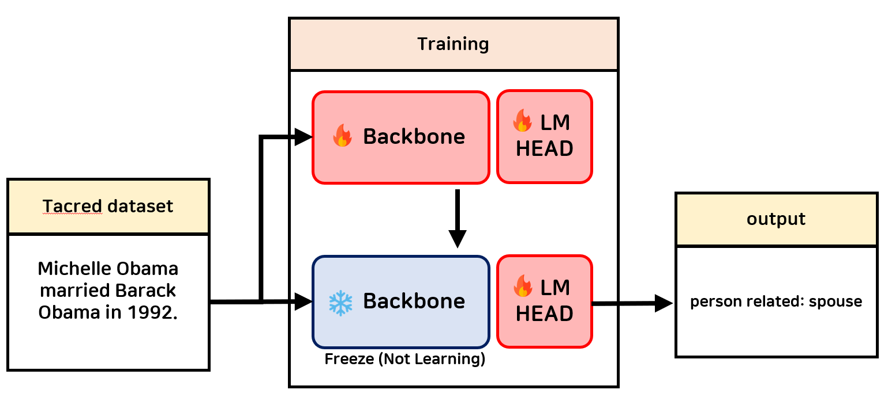

# Continual-Learning-for-Model-Improvement
## 프롬프팅 및 RAG 기법과 독립적으로 AI 모델 자체의 지속적인 성능 향상을 위한 Continual Learning 기법
### 💡 예시


## ⚙️ Requirements
To install requirements:
```
conda create -n ilvenv python=3.11.10
conda activate ilvenv
pip install -r requirements.txt
```

## 💻 Running Continual-Learning
### Step 1. 준비된 데이터셋으로 Continual Learning 진행
```
./scripts/run.sh
```

### Step 2. 학습된 모델 테스트
```
./scripts/chatting.sh
```

## 🧪 예시 데모
아래는 실제 사용 흐름을 보기 좋게 정리한 터미널 세션 예시다. 명령 프롬프트 기호와 시스템 메시지를 포함해 입출력이 한눈에 들어오도록 구성했다.

```text
(ilvenv) root@82c32631fb72:/workspace/Continual-Learning-for-Model-Improvement$ ./scripts/chatting.sh

───────────────────────────────────────────────────────────────────────────────

user      > Michelle Obama married Barack Obama in 1992. The relationship between Michelle Obama and Barack Obama is
assistant > person related: spouse

user      > Google was founded by Larry Page and Sergey Brin at Stanford. The relationship between Google and Larry Page is
assistant > organization related: founded by
```

## 🧠 Continual-Learning 작동 원리

이 프로젝트의 Continual Learning은 2단계 학습 과정을 통해 모델의 점진적 학습을 구현합니다:

### 1️⃣ 공동 학습 단계 (Backbone + LM Head)
- 첫 번째 학습 단계에서는 backbone과 LM Head를 함께 학습합니다
- 목적: backbone은 일반적 표현을 업데이트하고, LM Head는 해당 표현을 출력(언어모델링/태스크)으로 매핑하도록 함께 적합됩니다
- 데이터: 두 번째 단계와 동일한 데이터로 학습합니다

### 2️⃣ LM Head 단독 미세조정 단계 (Backbone freeze)
- 두 번째 단계에서는 backbone을 고정(freeze)하고 LM Head만 미세조정합니다
- 데이터: 1단계와 동일한 데이터로 학습합니다
- 이유: catastrophic forgetting은 주로 LM Head에서 발생하는 경향이 있어, backbone의 기존 지식을 보존하면서 LM Head만 안정적으로 재적합하기 위함입니다
- 효과: backbone의 일반 지식 보존, LM Head의 망각 완화, 전반적 성능과 안정성 향상

### 💡 장점
- 파국적 망각(Catastrophic Forgetting) 방지
- 효율적인 학습: 전체 모델이 아닌 일부분만 학습하여 계산 효율성 향상
- 안정적인 성능: 기존 지식을 유지하면서 새로운 태스크 학습 가능

`scripts/run.sh`를 실행하면 위 과정이 자동으로 순차적으로 진행되며, 각 단계별 학습 진행 상황은 wandb를 통해 모니터링할 수 있습니다.

## Reference

This project builds on:
- [ACL 2024] A Codebase for Incremental Learning with Large Language Models
  Code: https://github.com/zzz47zzz/codebase-for-incremental-learning-with-llm
